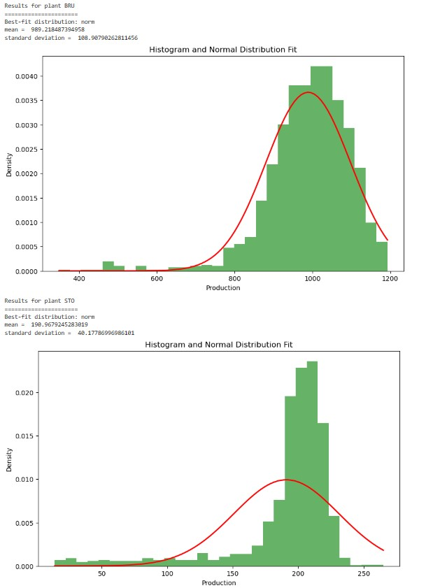
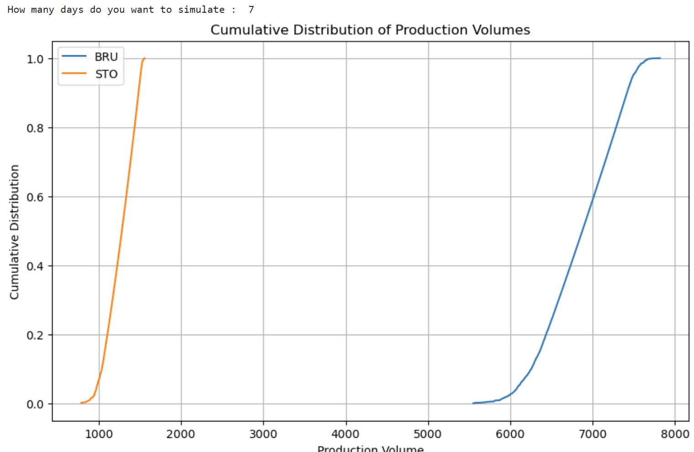

# modelingproductioncapability

## Overview assignment

This exercise involves analyzing production data from various factories across multiple cities. These factories produce a chemical compound measured in hectoliters, with all values rounded to the nearest integer.

The goal is to develop a model that can probabilistically predict future production amounts. Initially, we aim to model daily production. Subsequently, simulations will be employed to determine the distribution of production over multiple days.

For the current scope, it is assumed that production on specific days is independent and identically distributed (i.i.d.). Consequently, to simulate the total production over a 5-day period, one can simulate 5 values $p_1, p_2, p_3, p_4, p_5$, and the sum $p = \sum_{i=1}^5 p_i$ represents a realization of simulating production over a 5-day period.

## Github

https://github.com/Marvalutions/modelingproductioncapability.git

## Approach

Coding has been done in jupyter notebook. 
You will find these notebooks in directory 'notebooks'.  
I've divided the assignment in 3 main parts and for every part there's a seperate notebook.
 
    1. import_files (must be executed first, only once unless there's new input data)
    2. analyse_data
    3. simulation_pp

I will elaborate on the notebooks a bit further in the chapter  detailed assignment.

## Data
Data received for the assignment is stored in directory data/input and its subdirectories.
In the data/intermediate directory you will find the organized data which is cretaed when running the fist notebook 'import_files'

## Detailed assignment

**Step 1: Download and Organize Data**  

This is done by executing notebook 'import_files'.  
For each plant all seperate files with production results of 1  day are gathered in a dataframe and exported and saved to an excel-file fata/intermediate/'plant'.xls'.
The masterdata-file is not used further in the exercise as I don't necessarily need that data in the next steps.

There is a second notebook 'import_files_optimized_by_chatgpt' which is the optimization of the code from 'import_files' done by ChatGPT.
It does the same trick but about 20 times faster... 

**Step 2: Initialize Git Repository**  

https://github.com/Marvalutions/modelingproductioncapability.git  

**Step 3: Create Virtual Environment with Anaconda**  

The environment is saved in the main directory as modelingenv.yml  

**Step 4: Implement Python Code for Data Reading**  

This is also handeled in step 1 and notebook 'import_files'. 
All necessary data per plant is gathered in a seperate excel_file.
The other notebooks always start from that data.
If there would be an extra plant in the future for wich data with the same lay-out is delivered, it's just a question of running import_files again.
All other notebooks are capable of handling the information of extra plants.

**Step 5: Identify Suitable Distribution for Production Process**

To determine the most suitable distribution I choose to make use of the function 'find_best_fit_distribution_continuous' which is present in the
practicalbusinesspython-git. 
For every plant the program will print:
    - which distribution is best between normal, gamma, exponential and uniform. 
    - the main parameters 
    - a plot with a histogram and a calculated graph of the distribution according its main parameters .

_Remark : as the best distribution is normal for both plants, the coding of the output is especially for a normal distribution (not flexible). Optimization possible..._

**Step 6: Develop Simulation Program**
**Step 7: Use your simulation**

I choose to combine these 2 steps in 1 notebook 'simulation'.

For the simulation I choose to only use the produced volume of each day.
#MV-values :  as they were the result on days where there was maintenance, I choose to eliminate them. 
zero-values : There are quite a lot of them and they seem to be grouped several days after each other. So I made the assumption that these are planned delays in production beause of overstock.

The program wil ask you to input the desired number of days (#days) you want to simulate. 

Simulation-function : As it is assumed that production on specific days is independent and identically distributed (i.i.d.), the simulation-function will pick #days random values out of the volumes of daily-productions, add them together to get 1 simulation of the produced volume over #days. 10.000 simulations are being done for each plant. It returns a list of 10.000 produced volumes.

Per plant an item is added to dictionary with its simulation.

To generate the plot as asked in step 7, I choose to code it a bit different as proposed in the assignment. 
As I am not really familiar with statistics anymore, I had to google the formula and assumed it's the formula of a cumulative distribution function.
Some more googling learned me that if for each item you determine the sum of all lower values and that value and than divide these values by the biggest sum; you get a normalized list you can use for the plot.

The program plots the graphs for every plant on one figure as it seems to me that's the most usefull to compare values between the plants.

To get the simulation for 7 days, just enter 7 when the program ask you how many days you wish to simulate.

